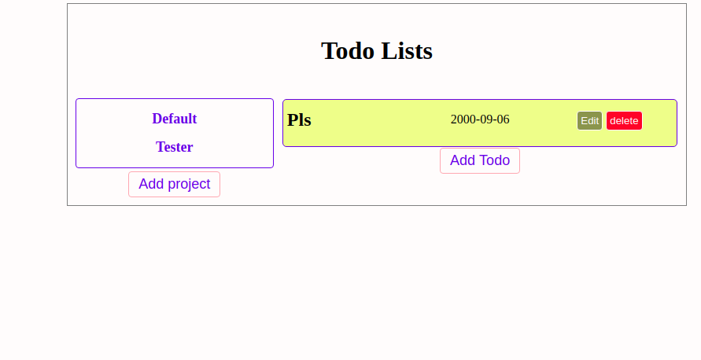

# TODO LIST APPLICATION

This is a todo application where users can create, edit, update and delete a todo or task under a specific project title.

## Built With
- Javascript
- Bootstrap
- ESLINT
- Webpack

## Getting Started
To get a local copy up and running follow these simple example steps:
 
### Prerequisite
To get a local copy of the repository please run the following commands on your terminal:
- cd <folder>
- git clone <a href="https://github.com/okikiola11/todo-list.git">https://github.com/Godswilly/library</a>
- Open the index.html file using your browser

## Live version
<a href="https://rawcdn.githack.com/okikiola11/todo-list/bd0112571d0fad69ee80e88d137c2d5ac2239c96/dist/index.html">Click here</a>

## Authors
- Okikiola Apelehin
- Kalu Agu Kalu

# Author 1
- Github: [@okikiola11](https://github.com/okikiola11)
- Twitter: [@Kikiolla3](https://twitter.com/Kikiolla3)
- Linkedin: [@okikiola-apelehin](https://www.linkedin.com/in/okikiola-apelehin-459008122/)

# Author 2
- Github: https://github.com/Godswilly
- LinkedIn: https://www.linkedin.com/in/kalu-agu-kalu/
- Twitter: https://twitter.com/KaluAguKalu17

## 🤝 Contributing

Contributions, issues and feature requests are welcome!

Feel free to check the [issues page](https://github.com/okikiola11/todo-list/issues).

## Show your support

Give a ⭐️ if you like this project!

## Acknowledgments

- Google

## 📝 License

This project is [MIT](lic.url) licensed.
